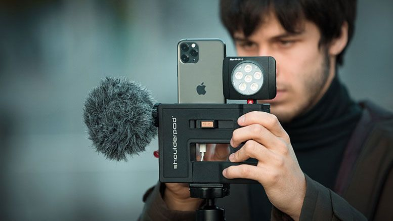

# Ishan-Kavit
together we are stronger.

## Member-1 
### Ishan mehra
**Introduction**
hii there,I am Ishan Mehra and I am from Punjab, India which is a renowned state there. I am 22 and if I talk about my hobbies, I love art and craft and in that, I love making miniatures specifically. Another hobby that I really enjoy is smartphone film-making, I don't know that when I got interested in this field, however I remember that I loved making short clips in my childhood and I am following the same till now. All I can say is that this activity provides me immense joy. Turning towards my family, there are 6 of us, my parents, my grandma and we are three siblings. I have two elder sisters. the agenda of my life is to become UX and UI designer. I also have many short term goals such as working experience in a restaurant, having a photoshoot of my own for a magazine, making a movie by my own. So, this is what I would say here about me.

**Hobbies**
1.Love Art and Craft

  

2.Smartphone Film-Making  

## Member-2
### Kavit patel
**Introduction**
hey there,I am Kavit Patel and i am from Gujarat,India.I am 20 and here i will talk about my hobbies.

1.Play Football

 

I Love to play football from my childhood i have got many achievement in my life. I am state player in football and hockey played i had for my community and school.I have football collection in my Hometown.

2.Cooking

I Like to cook new dishes.When i feel bored and frustrated i directly go to kitchen and try new things mostly i cook sweet in my childhood i got 1st price in making sweet name ladu.I will always try new dishes in future.

